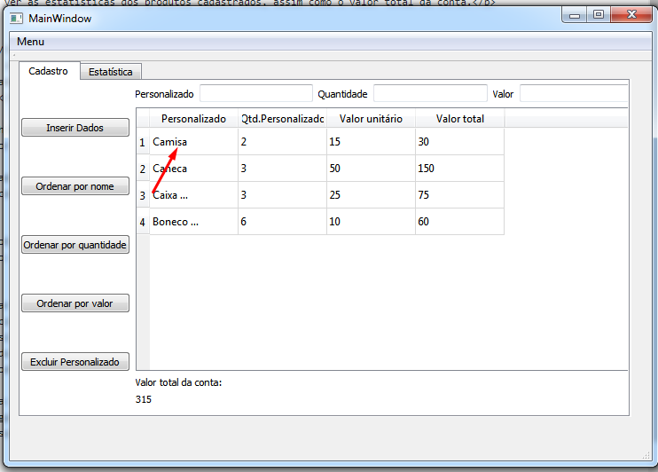

# Controle-de-vendas
<h1> Projeto feito para discilplina de programação estruturada 2019.2. O projeto foi desenvolvido para o controle de vendas de personalizados.</h1>

 O projeto permite ao usuário cadastrar o nome do personalizado, quantidade comprada e valor unitário do personalizado em questão, como também permite a ordenação da lista por 3 critérios como, nome, valor total e quantidade.

 Além da tela de cadastro, o projeto também possui uma tela de estatísticas, no qual o usuário pode acessar informações como, o personalizado com maior quantidade, menor, assim como o personalizado com maior valor total e também menor valor total.
 

<h1> Manual do usuário</h1>

 Para utilizar o programa é muito fácil, basta o usuário colocar 3 valores, válidos pelo programa, dessa forma,é interessante ressaltar que o usuário não deve digitar um nome com menos de 3 letras, assim como não deve colocar valores negativos em quantidade e valor unitário, como também não pode deixar valores em branco, caso o usuário faça isso, uma mensagem de erro será mostrada, informando que os dados que o usário digitou estão inválidos.Depois de colocar os dados válidos basta clicar no botão inserir e seus valores digitados serão incluidos na tabela de dados.

 Caso o usuário  digite algum valor invádo a mensagem que deverá ser mostrada é "Dados inválidos". 

 Além disso, é possível ver as estatísticas dos produtos cadastrados, assim como o valor total da conta.

<h1> Ordenando na tabela </h1>

 Para ordenar na tabela é muito simples, primeiramente o usuário deve cadastrar todos os personalizados de sua venda, depois basta clicar nos botões de ordenamento e então prontinho, sua tabela está ordenada.

<h1> Cadastrando na tabela</h1>

<h1> Ordenando por nome </h1>

 Ao clicar em ordenar por nome, o usuário vai ver sua tabela toda ordenado em ordem alfabética

<h1> Ordenando por quantidade</h1>

 No caso do usuário clicar em ordenar por quantidade, ele vai ver sua tabela ordena em ordem crescente de quantidade de personalizado.

<h1> Ordenando por valor total</h1>

 Por fim, caso o usuário clique em ordenar por valor, ele vai ter sua tabela ordenada por valor total dos personalizados do maior para o menor. 

<h1> E caso eu queira salvar o que foi vendido ? </h1>

 Para salvar e fazer o controle do que é vendido durante algum tempo, basta o usuário clicar no nome "menu" que lá ele verá a opção salvar, dessa forma, é possível o usuário salvar todas as suas vendas durante qualquer período de tempo, e fazer o balanceamente de quanto de dinheiro entrou durante esse tempo de vendas. Além disso, depois de salvar suas vendas, o usuário também pode carregar elas quando quiser, colocando todas as suas vendas de volta na tabela e para isso basta usar o "menu" onde ele verá a opção carregar. 

<h1> E caso eu erre na hora de cadastrar? </h1>

 Caso o usuário erre algum dado digitado do seu personalizado, ele poderá editar esse item, para isso basta ele clicar na célular da tabela que ele errou, e dessa forma irá aparecer uma mensagem perguntando se o usuário quer alterar o item selecionado.

<h1> Caso eu queira apagar algum personalizado da tabela?

 Para apagar algum personalizado é bem simples , basta o usuário digitar o nome do personalizado que quer apagar no local indicado pela seta vermelha.

 

 E depois basta clicar no botão excluir personalizado, e prontinho, personalizado excluido com sucesso.

